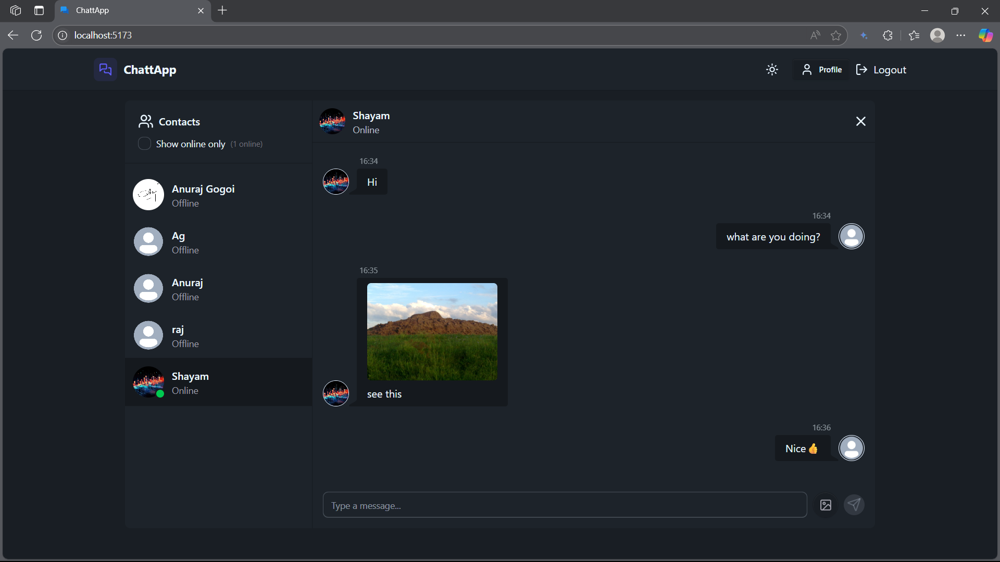
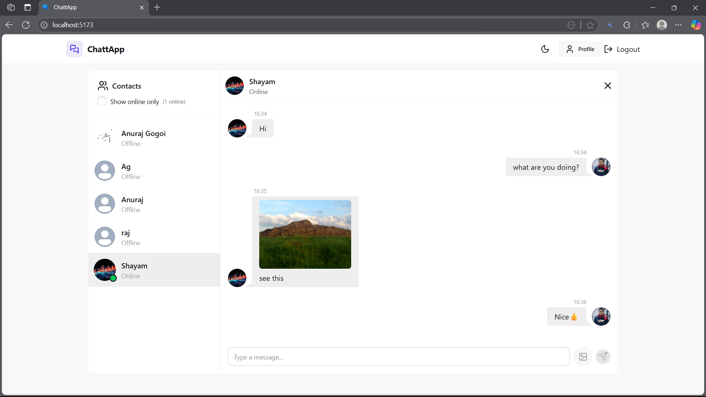
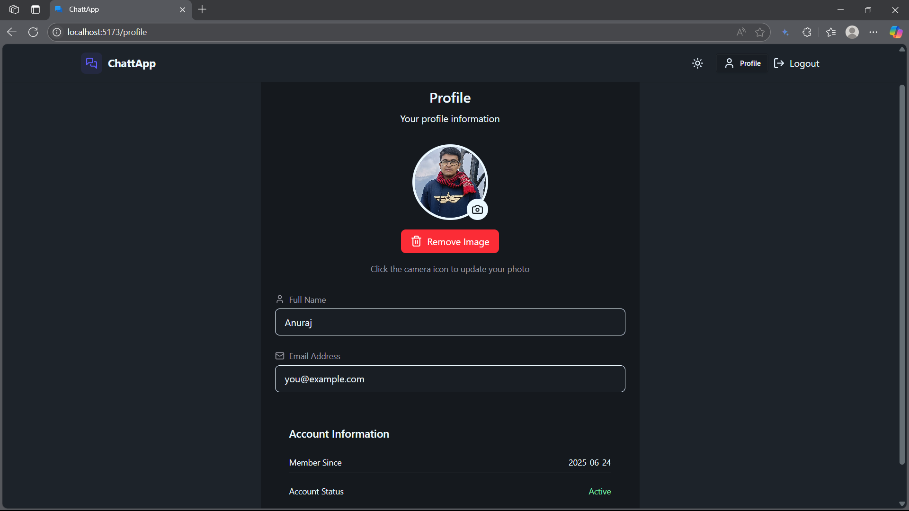
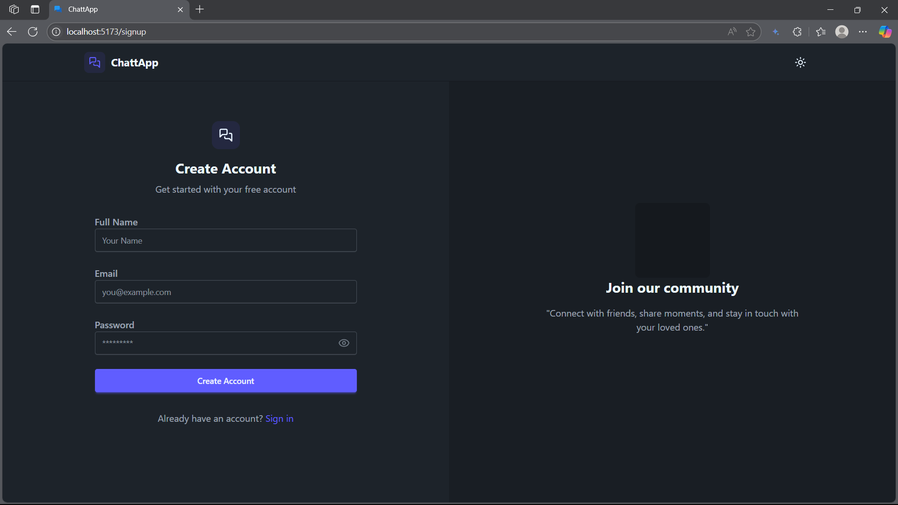
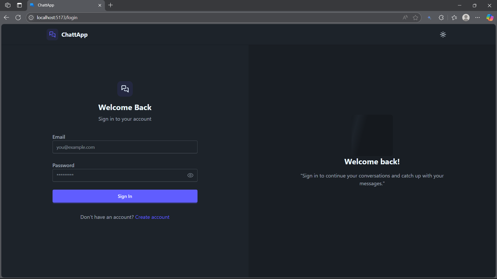

# ChattApp

A real-time chat application built with WebSocket technology, featuring user authentication, and one-to-one conversation.


## Features

- Real-time messaging with WebSocket connection

- User authentication with JWT tokens

- Image sharing via Cloudinary integration

- Theming (Light/Dark Mode): Toggle between light and dark modes to suit your preference

- MongoDB database for message persistence

- Profile Section with profile picture updation


## Technologies used

* Frontend: ReactJS (Vite), tailwindCss


* Backend: Node.js, Express.js

* Database: MongoDB Atlas

* Authentication: JWT (JSON Web Tokens)


* Real-time Communication: Socket.io

* File Storage: Cloudinary
## Installation

1. Clone the repository

```bash
  git clone https://github.com/gogoi-anuraj/ChattApp.git
  cd chattApp
```
   OR
      download the zip file and setup the project
    
2. Install dependencies
```bash
   npm install
```
3. Environment Setup
* Create a .env file in the root directory 

* Fill in your environment variables from the section below in the .env file:

4. Get Required Credentials
* MongoDB Atlas:

    - Sign up at https://www.mongodb.com/atlas
    - Create a new cluster
    - Get your connection string
    - Replace <username>, <password>, and <database_name> in the connection string

* Cloudinary:

    - Sign up at https://cloudinary.com/
    - Go to your dashboard
    - Copy your Cloud Name, API Key, and API Secret

* JWT Secret:
    - Generate a secure random string for JWT_SECRET:
```bash
     node -e "console.log(require('crypto').randomBytes(32).toString('hex'))"
```
5. Run the application
```bash 
     cd frontend
     npm run dev
```
   * Open a different terminal keeping the previous one running
```bash
    cd backend
    npm start
```

6. Access the application
Open your browser and navigate to:
http://localhost:5173
## Environment Variables

To run this project, you will need to add the following environment variables to your .env file

`MONGODB_URI`

`JWT_SECRET`

`CLOUDINARY_CLOUD_NAME`

`CLOUDINARY_API_KEY`

`CLOUDINARY_API_SECRET`

`NODE_ENV`=development


## Screenshots





